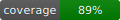
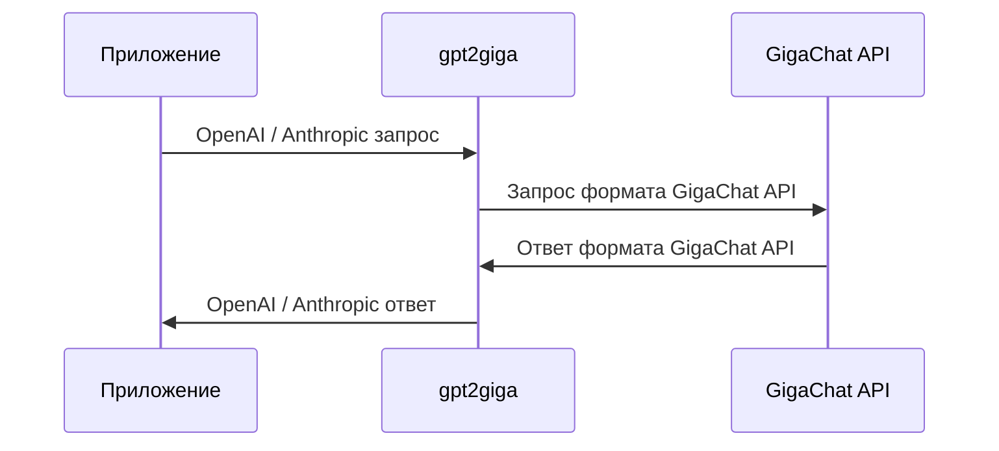

# Утилита для проксирования OpenAI/Anthropic-запросов в GigaChat

[](https://github.com/ai-forever/gpt2giga/actions/workflows/ci.yaml)
[](https://opensource.org/licenses/MIT)
[](https://pypistats.org/packages/gpt2giga)
[](https://star-history.com/#ai-forever/gpt2giga)
[](https://github.com/ai-forever/gpt2giga/issues)



## Содержание
1. [Описание](#описание)
2. [Возможности gpt2giga](#возможности-gpt2giga)
3. [Начало работы](#начало-работы)
   1. [Запуск в Docker](#запуск-в-docker)
   2. [Запуск в Docker с Traefik](#запуск-в-docker-с-traefik)
   3. [Локальный запуск](#локальный-запуск)
4. [Примеры](#примеры)
5. [Параметры](#изменение-параметров-gpt2giga)
   1. [Аргументы командной строки](#аргументы-командной-строки)
   2. [Переменные окружения](#переменные-окружения)
6. [Авторизация с помощью заголовка](#авторизация-с-помощью-заголовка)
7. [Использование HTTPS](#использование-https)
8. [Использование API ключа](#использование-api-ключа)
9. [Системные эндпоинты](#системные-эндпоинты)
10. [Совместимые приложения](#совместимые-приложения)


## Описание
Утилита gpt2giga — это прокси-сервер, который перенаправляет запросы, отправленные в OpenAI API или Anthropic Messages API, в GigaChat API.

При старте утилиты запускается HTTP-сервер, адрес которого нужно использовать вместо адреса OpenAI API (например, `https://api.openai.com/v1/`) или Anthropic API (например, `https://api.anthropic.com/v1/`), заданного в вашем приложении.
Утилита обработает запрос и перенаправит его заданной [модели GigaChat](https://developers.sber.ru/docs/ru/gigachat/models).
После получения ответа модели, она передаст его в приложение в формате исходного API (OpenAI или Anthropic).

Утилита работает как с запросами на генерацию, так и с запросами на создание эмбеддингов (эндпоинты `/embeddings` или `/v1/embeddings`).

Общая схема работы gpt2giga:



## Возможности gpt2giga

С помощью gpt2giga вы можете:

- использовать возможности моделей OpenAI и полностью заменить ChatGPT на GigaChat;
- **использовать Anthropic SDK** — эндпоинт `/v1/messages` совместим с Anthropic Messages API, включая стриминг, tool use и extended thinking;
- вызывать функции через API, включая передачу и выполнение функций с аргументами;
- использовать структурированный вывод (Structured Outputs) для получения гарантированного JSON-ответа;
- обрабатывать ответ модели в режиме потоковой генерации токенов с помощью параметра `stream=true`;
- перенаправлять запросы на создание эмбеддингов (поддерживаются эндпоинты `/embeddings` и `/v1/embeddings`);
- работать в асинхронном режиме с множеством потоков запросов от нескольких клиентов;
- общение в openai-формате с файлом;
- использовать эндпоинт `/responses` (OpenAI Responses API) для совместимости с новыми клиентами;
- отображать подробные сведения о запросах и ответах при включенном логировании `DEBUG`, `INFO` ...;
- задавать параметры работы как с помощью аргументов командной строки, так и с помощью переменных окружения (`.env`).

## Начало работы

Утилиту можно запустить как в контейнере, с помощью Docker, так и локально.

### Запуск в Docker

1. Переименуйте файл [`.env.example`](./.env.example) в `.env`.

   ```sh
   cp .env.example .env
   ```

2. В файле `.env` укажите данные для авторизации в GigaChat API.

   GigaChat API поддерживает различные способы авторизации, которые отличаются в зависимости от типа вашей учетной записи. Пример с `Authorization key`.

    ```dotenv
    GPT2GIGA_MODE=PROD
    GPT2GIGA_HOST=0.0.0.0
    GPT2GIGA_PORT=8090
    GPT2GIGA_ENABLE_API_KEY_AUTH=True
    GPT2GIGA_API_KEY="<your_strong_api_key>"
    GIGACHAT_CREDENTIALS="<your_gigachat_credentials>"
    GIGACHAT_SCOPE=<your_api_scope>
    GIGACHAT_MODEL=GigaChat
    GIGACHAT_VERIFY_SSL_CERTS=True
    ```

3. (Опционально) Используйте образ/сборку с нужной версией Python (3.10–3.14).

   В `docker-compose.yaml` по умолчанию задан `image: ghcr.io/ai-forever/gpt2giga:latest` и `build.args.PYTHON_VERSION`. При необходимости:
   - обновите `build.args.PYTHON_VERSION` (если собираете образ локально);
   - или замените `image:` на нужный тег из реестра.

   ```sh
   PYTHON_VERSION=3.10
   docker pull gigateam/gpt2giga:python${PYTHON_VERSION}
   docker pull ghcr.io/ai-forever/gpt2giga:${PYTHON_VERSION}
   ```

   Доступные теги смотрите в реестрах: [Docker Hub](https://hub.docker.com/r/gigateam/gpt2giga) и [GHCR](https://github.com/ai-forever/gpt2giga/pkgs/container/gpt2giga).

4. Запустите контейнер с помощью Docker Compose:

   - PROD:
     ```sh
     docker compose --profile PROD up -d
     ```
   - DEV:
     ```sh
     docker compose --profile DEV up -d
     ```

   > В профиле `PROD` порт по умолчанию пробрасывается только на `127.0.0.1` (см. `docker-compose.yaml`). Для доступа извне используйте reverse proxy (nginx/Traefik/Caddy) или измените bind-адрес в `ports:`.

### Запуск в Docker с Traefik

В репозитории есть готовый стек `Traefik + несколько инстансов gpt2giga` в файле [`docker-compose.traefik.yaml`](./docker-compose.traefik.yaml):
- `gpt2giga` (модель по умолчанию `GigaChat`) → `http://localhost:8090`
- `gpt2giga-pro` (модель по умолчанию `GigaChat-Pro`) → `http://localhost:8091`
- `gpt2giga-max` (модель по умолчанию `GigaChat-Max`) → `http://localhost:8092`
- Traefik Dashboard → `http://localhost:8080/dashboard/`

1. Запустите стек:

   ```sh
   docker compose -f docker-compose.traefik.yaml up -d
   ```

> Важно: роутинг в Traefik в этой конфигурации завязан на HTTP `Host` (см. `traefik/rules.yml`). Если вы обращаетесь по IP (например, `127.0.0.1`), задайте `HOST=127.0.0.1` или отправляйте корректный заголовок `Host:`.

### Локальный запуск

Для управления зависимостями и запуска проекта рекомендуется использовать [uv](https://github.com/astral-sh/uv).

1. Установите `gpt2giga`:

   С помощью `uv`:
   ```sh
   uv tool install gpt2giga
   # или uv add gpt2giga
   ```

   Или используя `pip`:
   ```sh
   pip install gpt2giga
   ```

   Вы также можете использовать исходники:

   ```sh
   pip install git+https://github.com/ai-forever/gpt2giga.git
   ```

   После установки пакета вы сможете использовать команду `gpt2giga`, которая позволяет запускать и настраивать прокси-сервер.

2. Переименуйте файл [`.env.example`](./.env.example) в `.env` и сохраните его в корне своего проекта:

   ```sh
   cp .env.example .env
   ```

3. В файле `.env` укажите данные для авторизации в GigaChat API.

   GigaChat API поддерживает различные способы авторизации, которые отличаются в зависимости от типа вашей учетной записи.

   > Кроме переменных gpt2giga в `.env` можно указать переменные окружения, которые поддерживает [python-библиотека GigaChat](https://github.com/ai-forever/gigachat#настройка-переменных-окружения).


4. В терминале выполните команду `gpt2giga`.

Запустится прокси-сервер, по умолчанию доступный по адресу `localhost:8090` (если не задан `GPT2GIGA_PORT` или `--proxy.port`).
Адрес и порт сервера, а также другие параметры, можно настроить с помощью аргументов командной строки или переменных окружения.
Документация FastAPI доступна по адресу `http://localhost:<PORT>/docs`.

## Примеры

Подробные runnable-примеры вынесены в папку [`examples/`](./examples/).

- OpenAI Python SDK:
  - Chat Completions API: [`examples/chat_completions/README.md`](./examples/chat_completions/README.md)
  - Responses API: [`examples/responses/README.md`](./examples/responses/README.md)
- Anthropic Python SDK (Messages API): [`examples/anthropic/README.md`](./examples/anthropic/README.md)
- Индекс всех примеров: [`examples/README.md`](./examples/README.md)

## Изменение параметров gpt2giga

Вы можете изменять параметры работы утилиты с помощью аргументов командной строки или переменных окружения.

### Аргументы командной строки

Полный список параметров смотрите в `gpt2giga --help`.

> **⚠️ Безопасность:** Не передавайте секреты (`--proxy.api-key`, `--gigachat.credentials`, `--gigachat.password`, `--gigachat.access-token`, `--gigachat.key-file-password`) через аргументы командной строки — они видны всем пользователям через `ps aux`. Используйте переменные окружения или `.env` файл (см. раздел ниже).
Утилита поддерживает аргументы 2 типов (настройки прокси и настройки GigaChat):
- `--env-path <PATH>` — путь до файла с переменными окружения `.env`. По умолчанию ищется `.env` в текущей директории.

- `--proxy [JSON]` — set proxy from JSON string (по умолчанию `{}`);
- `--proxy.host <HOST>` — хост, на котором запускается прокси-сервер. По умолчанию `localhost`;
- `--proxy.port <PORT>` — порт, на котором запускается прокси-сервер. По умолчанию `8090`;
- `--proxy.use-https <true/false>` — использовать ли HTTPS. По умолчанию `False`;
- `--proxy.https-key-file <PATH>` — Путь до key файла для https. По умолчанию `None`;
- `--proxy.https-cert-file <PATH>` — Путь до cert файла https. По умолчанию `None`;
- `--proxy.pass-model <true/false>` — передавать в GigaChat API модель, которую указал клиент в поле `model` в режиме чата;
- `--proxy.pass-token <true/false>` — передавать токен, полученный в заголовке `Authorization`, в GigaChat API. С помощью него можно настраивать передачу ключей в GigaChat через `OPENAI_API_KEY`;
- `--proxy.embeddings <EMBED_MODEL>` — модель, которая будет использоваться для создания эмбеддингов. По умолчанию `EmbeddingsGigaR`;
- `--proxy.enable-images <true/false>` — включить/выключить передачу изображений в формате OpenAI в GigaChat API (по умолчанию `True`);
- `--proxy.enable-reasoning <true/false>` — включить reasoning по умолчанию (добавляет `reasoning_effort="high"` в payload к GigaChat, если клиент не указал `reasoning_effort` явно);
- `--proxy.log-level` — уровень логов `{CRITICAL,ERROR,WARNING,INFO,DEBUG}`. По умолчанию `INFO`;
- `--proxy.log-filename` — имя лог файла. По умолчанию `gpt2giga.log`;
- `--proxy.log-max-size` — максимальный размер файла в байтах. По умолчанию `10 * 1024 * 1024` (10 MB);
- `--proxy.enable-api-key-auth` — нужно ли закрыть доступ к эндпоинтам (требовать API-ключ). По умолчанию `False`;
- `--proxy.api-key` — API ключ для защиты эндпоинтов (если enable_api_key_auth=True).

> **⚠️ Безопасность:** Не передавайте секреты (`--proxy.api-key`, `--gigachat.credentials`, `--gigachat.password`, `--gigachat.access-token`, `--gigachat.key-file-password`) через аргументы командной строки — они видны всем пользователям через `ps aux`. Используйте переменные окружения или `.env` файл (см. раздел ниже).

Далее идут стандартные настройки из библиотеки GigaChat:
- `--gigachat [JSON]` — set gigachat from JSON string (по умолчанию `{}`);
- `--gigachat.base-url <BASE_URL>` — базовый URL для GigaChat API. По умолчанию берется значение переменной `GIGACHAT_BASE_URL` или поля `BASE_URL` внутри пакета;
- `--gigachat.auth-url <AUTH_URL>` — базовый URL для Auth GigaChat API. По умолчанию берется значение переменной `GIGACHAT_AUTH_URL` или поля `AUTH_URL` внутри пакета;
- `--gigachat.credentials <CREDENTIALS>` — credentials (ключ/данные авторизации) для GigaChat;
- `--gigachat.scope <GIGACHAT_SCOPE>` — Скоуп гигачат (API_CORP, API_PERS...);
- `--gigachat.user <GIGACHAT_USER>` — Вариант авторизации через user/password;
- `--gigachat.password <GIGACHAT_PASSWORD>` — Вариант авторизации через user/password;
- `--gigachat.access-token <ACCESS_TOKEN>` — JWE токен;
- `--gigachat.model <MODEL>` — модель для запросов в GigaChat. По умолчанию `GIGACHAT_MODEL`;
- `--gigachat.profanity-check <True/False>` — Параметр цензуры. По умолчанию `None`;
- `--gigachat.timeout <TIMEOUT>` — таймаут для запросов к GigaChat API. По умолчанию `30` секунд;
- `--gigachat.verify-ssl-certs <True/False>` — проверять сертификаты SSL (по умолчанию `True`);
- `--gigachat.ssl-context` — Пользовательский SSL контекст;
- `--gigachat.ca-bundle-file <PATH>` — Путь к CA bundle файлу для проверки TLS сертификатов;
- `--gigachat.cert-file <PATH>` — Путь к файлу клиентского сертификата;
- `--gigachat.key-file <PATH>` — Путь к файлу приватного ключа клиента;
- `--gigachat.key-file-password <PASSWORD>` — Пароль для зашифрованного файла приватного ключа;
- `--gigachat.flags <FLAGS>` — Дополнительные флаги для управления поведением клиента;
- `--gigachat.max-connections <INT>` — Максимальное количество одновременных подключений к GigaChat API;
- `--gigachat.max-retries <INT>` — Максимальное количество попыток повтора для временных ошибок. По умолчанию `0` (отключено);
- `--gigachat.retry-backoff-factor <FLOAT>` — Множитель задержки для повторных попыток. По умолчанию `0.5`;
- `--gigachat.retry-on-status-codes <INT,INT...>` — HTTP коды статуса, вызывающие повторную попытку. По умолчанию `(429, 500, 502, 503, 504)`;
- `--gigachat.token-expiry-buffer-ms <INT>` — Буфер времени (мс) до истечения токена для запуска обновления. По умолчанию `60000` (60 секунд).
#### Пример запуска утилиты с заданными параметрами

Для запуска прокси-сервера с заданным адресом и портом выполните команду:

```sh
gpt2giga \
    --proxy.host 127.0.0.1 \
    --proxy.port 8080 \
    --proxy.pass-model true \
    --proxy.pass-token true \
    --gigachat.base-url https://gigachat.devices.sberbank.ru/api/v1 \
    --gigachat.model GigaChat-2-Max \
    --gigachat.timeout 300 \
    --proxy.embeddings EmbeddingsGigaR
```

### Переменные окружения

Для настройки параметров утилиты также можно использовать переменные окружения, заданные в файле `.env`.

У настроек прокси префикс `GPT2GIGA_`, у настроек GigaChat: `GIGACHAT_`

Список доступных переменных:

- `GPT2GIGA_HOST="localhost"` — хост, на котором запускается прокси-сервер. По умолчанию `localhost`;
- `GPT2GIGA_MODE="DEV"` — режим запуска (`DEV` или `PROD`). В `PROD` отключаются `/docs`, `/redoc`, `/openapi.json`;
  в `PROD` также обязательно требуется `GPT2GIGA_API_KEY`, отключаются `/logs`, `/logs/stream`, `/logs/html`;
  и автоматически ужесточается CORS (нет wildcard `*`, `allow_credentials=False`);
- `GPT2GIGA_PORT="8090"` — порт, на котором запускается прокси-сервер. По умолчанию `8090`;
- `GPT2GIGA_USE_HTTPS="False"` — Использовать ли https. По умолчанию `False`;
- `GPT2GIGA_HTTPS_KEY_FILE=<PATH>` — Путь до key файла для https. По умолчанию `None`;
- `GPT2GIGA_HTTPS_CERT_FILE=<PATH>` — Путь до cert файла https. По умолчанию `None`;
- `GPT2GIGA_PASS_MODEL="False"` — передавать ли модель, указанную в запросе, непосредственно в GigaChat;
- `GPT2GIGA_PASS_TOKEN="False"` — передавать токен, полученный в заголовке `Authorization`, в GigaChat API;
- `GPT2GIGA_EMBEDDINGS="EmbeddingsGigaR"` — модель для создания эмбеддингов.
- `GPT2GIGA_ENABLE_IMAGES="True"` — флаг, который включает передачу изображений в формате OpenAI в GigaChat API;
- `GPT2GIGA_ENABLE_REASONING="False"` — включить reasoning по умолчанию (добавляет `reasoning_effort="high"` в payload к GigaChat, если клиент не указал `reasoning_effort` явно);
- `GPT2GIGA_LOG_LEVEL="INFO"` — Уровень логов `{CRITICAL,ERROR,WARNING,INFO,DEBUG}`. По умолчанию `INFO`
- `GPT2GIGA_LOG_FILENAME="gpt2giga.log"` — Имя лог файла. По умолчанию `gpt2giga.log`
- `GPT2GIGA_LOG_MAX_SIZE="10*1024*1024"` Максимальный размер файла в байтах. По умолчанию `10 * 1024 * 1024` (10 MB)
- `GPT2GIGA_ENABLE_API_KEY_AUTH="False"` — Нужно ли закрыть доступ к эндпоинтам (требовать API-ключ). По умолчанию `False`
- `GPT2GIGA_API_KEY=""` — API ключ для защиты эндпоинтов (если enable_api_key_auth=True).
- `GPT2GIGA_CORS_ALLOW_ORIGINS='["*"]'` — список разрешенных Origin (JSON массив);
- `GPT2GIGA_CORS_ALLOW_METHODS='["*"]'` — список разрешенных HTTP-методов (JSON массив);
- `GPT2GIGA_CORS_ALLOW_HEADERS='["*"]'` — список разрешенных заголовков (JSON массив).

Также можно использовать переменные, которые поддерживает [библиотека GigaChat](https://github.com/ai-forever/gigachat#настройка-переменных-окружения):
- `GIGACHAT_BASE_URL="https://gigachat.devices.sberbank.ru/api/v1"` — базовый URL GigaChat;
- `GIGACHAT_MODEL="GigaChat"` — модель GigaChat API, которая будет обрабатывать запросы по умолчанию;
- `GIGACHAT_USER` и `GIGACHAT_PASSWORD` — для авторизации с помощью с помощью логина и пароля;
- `GIGACHAT_CREDENTIALS` и `GIGACHAT_SCOPE` — для авторизации с помощью ключа авторизации;
- `GIGACHAT_ACCESS_TOKEN` — для авторизации с помощью токена доступа, полученного в обмен на ключ;
- `GIGACHAT_CA_BUNDLE_FILE` - путь к файлу сертификата корневого центра сертификации;
- `GIGACHAT_CERT_FILE` - путь к клиентскому сертификату;
- `GIGACHAT_KEY_FILE` - путь к закрытому ключу;
- `GIGACHAT_KEY_FILE_PASSWORD` - пароль от закрытого ключа;
- `GIGACHAT_VERIFY_SSL_CERTS` — для того, чтобы проверять SSL сертификаты, по умолчанию `True`;
- `GIGACHAT_MAX_CONNECTIONS` - Максимальное количество одновременных подключений к GigaChat API;
- `GIGACHAT_MAX_RETRIES` - Максимальное количество попыток повтора для временных ошибок. По умолчанию `0` (отключено);
- `GIGACHAT_RETRY_BACKOFF_FACTOR` - Множитель задержки для повторных попыток. По умолчанию `0.5`;
- `GIGACHAT_TOKEN_EXPIRY_BUFFER_MS` - Буфер времени (мс) до истечения токена для запуска обновления. По умолчанию `60000` (60 секунд).

После запуска сервер будет перенаправлять все запросы, адресованные OpenAI API, в GigaChat API.

## Авторизация с помощью заголовка

Утилита может авторизовать запросы в GigaChat API с помощью данных, полученных в заголовке `Authorization`.

Для этого запустите gpt2giga с аргументом `--proxy.pass-token true` или задайте переменную окружения `GPT2GIGA_PASS_TOKEN=True`.
Поддерживается авторизация с помощью ключа, токена доступа и логина и пароля.

Возможные варианты содержимого заголовка `Authorization`:

- `giga-cred-<credentials>:<scope>` — авторизация с помощью ключа. Вместо `<scope>` нужно указать версию API, к которой будут выполняться запросы. [Подробнее о ключе авторизации и версии API](https://github.com/ai-forever/gigachat?tab=readme-ov-file#параметры-объекта-gigachat).
- `giga-auth-<access_token>` — при авторизации с помощью токена доступа. Токен доступа получается в обмен на ключ авторизации и действителен в течение 30 минут.
- `giga-user-<user>:<password>` — при авторизации с помощью логина и пароля.

```python
from openai import OpenAI

client = OpenAI(base_url="http://localhost:8090", api_key="giga-cred-<credentials>:<scope>")

completion = client.chat.completions.create(
    model="gpt-5",
    messages=[
        {"role": "user", "content": "Кто ты?"},
    ],
)
```

## Использование HTTPS

Утилита может использоваться с протоколом HTTPS, пример генерации сертификатов:
```bash
openssl req -x509 -nodes -days 365   -newkey rsa:4096   -keyout key.pem   -out cert.pem   -subj "/CN=localhost"   -addext "subjectAltName=DNS:localhost,IP:127.0.0.1"
```
```dotenv
GPT2GIGA_USE_HTTPS=True
GPT2GIGA_HTTPS_KEY_FILE="Path to key.pem"
GPT2GIGA_HTTPS_CERT_FILE="Path to cert.pem"
```
После этого укажите пути к сертификатам в переменных окружения или CLI-аргументах и включите HTTPS.

Альтернатива: разместите `gpt2giga` за reverse proxy с TLS-терминацией:
- пример стека с Traefik: [`docker-compose.traefik.yaml`](./docker-compose.traefik.yaml) и правила в `traefik/` (при необходимости добавьте ACME/сертификаты под свой домен).

## Использование API ключа
```dotenv
GPT2GIGA_ENABLE_API_KEY_AUTH=True
GPT2GIGA_API_KEY=123
```

После этого, в сервисе будет добавлена авторизация по токену. Возможны разные варианты выполнения запросов, например:
Авторизация по запросу:
```bash
curl -L http://localhost:8090/models?x-api-key=123
```
Авторизация по заголовкам:
```bash
curl -H "x-api-key:123" -L http://localhost:8090/models
```
Авторизация через Bearer:
```bash
 curl -H "Authorization: Bearer 123" -L http://localhost:8090/models
```
```python
from openai import OpenAI

client = OpenAI(base_url="http://localhost:8090", api_key="123")

completion = client.chat.completions.create(
    model="gpt-5",
    messages=[
        {"role": "user", "content": "Кто ты?"},
    ],
)
```
## Системные эндпоинты
- `GET /health`
- `GET | POST /ping`
- `GET /logs/{last_n_lines}` - получение последних N строчек из логов;
- `GET /logs/stream` - SSE стриминг логов;
- `GET /logs/html` - HTML страница для удобства просмотра стрима логов

При использовании можно зайти на страницу: `http://localhost:8090/logs/html` и:
1. Если используется API ключ [Использование API ключа](#использование-api-ключа), то введите ваш `GPT2GIGA_API_KEY`
2. Иначе, введите любой символ

После этого, воспользуйтесь утилитой и будут выведены логи.

> **⚠️ Безопасность:** Эндпоинты `/logs*` предназначены только для разработки. В `PROD` режиме (`GPT2GIGA_MODE=PROD`) они автоматически отключены. Не открывайте log-эндпоинты наружу без аутентификации.
## Production hardening checklist

Перед развертыванием gpt2giga в production-среде убедитесь, что выполнены следующие шаги:

### Обязательные

- [ ] **Режим PROD**: установите `GPT2GIGA_MODE=PROD`. В этом режиме автоматически отключаются `/docs`, `/redoc`, `/openapi.json` и все `/logs*`-эндпоинты; CORS ужесточается (нет wildcard `*`, `allow_credentials=False`).
- [ ] **API key аутентификация**: установите `GPT2GIGA_ENABLE_API_KEY_AUTH=True` и задайте надёжный `GPT2GIGA_API_KEY` (минимум 32 символа, случайная строка).
- [ ] **TLS-сертификаты GigaChat**: установите `GIGACHAT_VERIFY_SSL_CERTS=True`. Не отключайте проверку SSL в production.
- [ ] **HTTPS**: включите `GPT2GIGA_USE_HTTPS=True` и укажите пути к TLS-сертификатам (`GPT2GIGA_HTTPS_KEY_FILE`, `GPT2GIGA_HTTPS_CERT_FILE`), либо разместите прокси за reverse proxy (nginx, Caddy, Traefik) с TLS-терминацией.
- [ ] **CORS origins**: ограничьте `GPT2GIGA_CORS_ALLOW_ORIGINS` конкретными доменами вместо `["*"]`.
- [ ] **Секреты**: храните `GIGACHAT_CREDENTIALS`, `GPT2GIGA_API_KEY` и другие секреты в переменных окружения или secrets manager.
- [ ] **Не передавайте секреты через CLI**: используйте `.env` или переменные окружения вместо `--proxy.api-key` и `--gigachat.credentials` (аргументы видны в `ps aux`).

### Рекомендуемые

- [ ] **Reverse proxy**: разместите gpt2giga за reverse proxy (nginx, Caddy и др.) для rate limiting, TLS-терминации и дополнительной фильтрации.
- [ ] **Уровень логов**: установите `GPT2GIGA_LOG_LEVEL=WARNING` или `INFO` (не `DEBUG`) для production — уровень `DEBUG` может содержать чувствительные данные в логах.
- [ ] **Network isolation**: запускайте gpt2giga в изолированной сети, чтобы исключить доступ к внутренним сервисам через SSRF.
- [ ] **Мониторинг**: настройте мониторинг `/health` и `/ping` эндпоинтов.
- [ ] **Ротация секретов**: регулярно обновляйте `GPT2GIGA_API_KEY` и `GIGACHAT_CREDENTIALS`.

## Совместимые приложения

Таблица содержит приложения, проверенные на совместную работу с gpt2giga.


| Название агента/фреймворка | URL                                                | Описание                                                                                                                                    |
|----------------------------|----------------------------------------------------|---------------------------------------------------------------------------------------------------------------------------------------------|
| OpenCode                   | https://opencode.ai/                               | AI-агент с открытым исходным кодом                                                                                                          |
| KiloCode                   | https://kilo.ai/                                   | AI-агент для написания кода, доступен в JetBrains/VSCode                                                                                    |
| OpenHands                  | https://openhands.dev/                             | AI-ассистент для разработки<br /> Подробнее о запуске и настройке OpenHands для работы с gpt2giga — в [README](./integrations/openhands)    |
| Zed                        | https://zed.dev/                                   | AI-ассистент                                                                                                                                |
| Cline                      | https://cline.bot/                                 | AI-ассистент разработчика                                                                                                                   |
| OpenAI Codex               | https://github.com/openai/codex                    | CLI агент от OpenAI                                                                                                                         |
| Aider                      | https://aider.chat/                                | AI-ассистент для написания приложений.<br /> Подробнее о запуске и настройке Aider для работы с gpt2giga — в [README](./integrations/aider) |
| Langflow                   | https://github.com/langflow-ai/langflow            | Low/No-code платформа для создания агентов                                                                                                  |
| DeepAgentsCLI              | https://github.com/langchain-ai/deepagents         | Deep Agents — это платформа для работы с агентами, построенная на основе langchain и langgraph                                              |
| CrewAI                     | https://github.com/crewAIInc/crewAI                | Фреймворк для оркестрации агентов                                                                                                           |
| Qwen Agent                 | https://github.com/QwenLM/Qwen-Agent               | Фреймворк                                                                                                                                   |
| PydanticAI                 | https://github.com/pydantic/pydantic-ai            | GenAI Agent Framework, the Pydantic way                                                                                                     |
| Camel                      | https://github.com/camel-ai/camel                  | Мультиагентный фреймворк                                                                                                                    |
| smolagents                 | https://github.com/huggingface/smolagents          | Фреймворк от hf                                                                                                                             |
| Openclaw                   | https://openclaw.ai/                               | Personal AI assistant                                                                                                                       |
| Claude Code                | https://code.claude.com/docs/en/overview           | CLI агент от Anthropic                                                                                                                      |
| OpenAI Agents SDK          | https://github.com/openai/openai-agents-python     | SDK для создания агентов с function calling и handoffs. Пример использования — в [examples/openai_agents.py](./examples/openai_agents.py)   |
| Anthropic SDK              | https://github.com/anthropics/anthropic-sdk-python | Официальный Python SDK для Anthropic API. Примеры использования — в [examples/anthropic/](./examples/anthropic/)                            |
| Cursor                     | https://cursor.com/                                | Cursor — это редактор на основе искусственного интеллекта и агент для программирования                                                      |

## История изменений

Подробная информация об изменениях в каждой версии доступна в файле [CHANGELOG.md](CHANGELOG.md) или [CHANGELOG_en.md](CHANGELOG_en.md).

## Лицензия

Проект распространяется под лицензией MIT.
Подробная информация — в файле [LICENSE](LICENSE).
