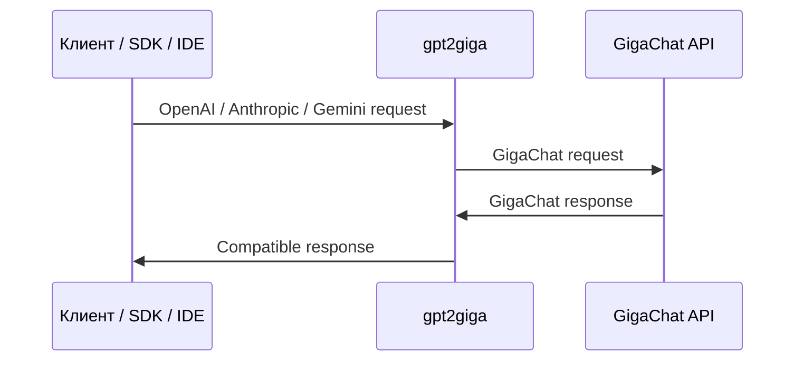

# gpt2giga

[](https://github.com/ai-forever/gpt2giga/actions/workflows/ci.yaml)
[](https://opensource.org/licenses/MIT)
[](https://pypistats.org/packages/gpt2giga)
[](https://star-history.com/#ai-forever/gpt2giga)
[](https://github.com/ai-forever/gpt2giga/issues)


`gpt2giga` — это FastAPI-прокси, который принимает OpenAI-, Anthropic- и Gemini-совместимые запросы и преобразует их в вызовы GigaChat API. Он нужен в ситуациях, когда клиент, SDK, IDE или агент умеет работать с популярным API-форматом, а фактический backend у вас — GigaChat.

Сервис полезен, если вы хотите:

- подключить GigaChat к OpenAI-compatible клиентам без переписывания приложения;
- использовать Anthropic Messages API или Gemini Developer API поверх GigaChat;
- запускать editors, coding agents и SDK-примеры через единый локальный proxy endpoint;
- централизованно управлять API-key auth, логированием, telemetry и runtime-конфигурацией.

## Как это работает


```mermaid
sequenceDiagram
    participant Client as Клиент / SDK / IDE
    participant Proxy as gpt2giga
    participant GigaChat as GigaChat API

    Client->>Proxy: OpenAI / Anthropic / Gemini request
    Proxy->>GigaChat: GigaChat request
    GigaChat->>Proxy: GigaChat response
    Proxy->>Client: Compatible response
```

## Быстрый старт

### Локальный запуск из репозитория

1. Скопируйте конфигурацию:

   ```bash
   cp .env.example .env
   ```

2. Укажите в `.env` как минимум:

   ```dotenv
   GPT2GIGA_MODE=DEV
   GPT2GIGA_ENABLE_API_KEY_AUTH=True
   GPT2GIGA_API_KEY="<your_api_key>"
   GIGACHAT_CREDENTIALS="<your_gigachat_credentials>"
   GIGACHAT_SCOPE=GIGACHAT_API_PERS
   GIGACHAT_MODEL=GigaChat-2-Max
   ```

3. Установите зависимости и запустите proxy:

   ```bash
   uv sync --all-extras --dev
   uv run gpt2giga
   ```

После старта proxy по умолчанию доступен на `http://localhost:8090`.

### Docker / Compose

```bash
cp .env.example .env
make compose-base-dev-d
```

Полная карта compose-сценариев, включая observability, multi-instance, Traefik и runtime backend examples: [deploy/README.md](./deploy/README.md).

Для production, reverse proxy и multi-instance сценариев используйте [docs/operator-guide.md](./docs/operator-guide.md) и [docs/integrations/nginx/README.md](./docs/integrations/nginx/README.md).

### Какие base URL использовать

| Клиент | Базовый URL |
|---|---|
| OpenAI-compatible | `http://localhost:8090` или `http://localhost:8090/v1` |
| Anthropic-compatible | `http://localhost:8090` |
| Gemini Developer API-compatible | `http://localhost:8090/v1beta` |

В `DEV` режиме OpenAPI и Swagger UI доступны по `http://localhost:8090/docs`. В `PROD` они отключаются автоматически.

## Что поддерживается

`gpt2giga` не пытается реализовать все официальные API целиком. Он покрывает тот набор маршрутов, который обычно нужен в proxy-сценариях.

| Surface | Основное покрытие |
|---|---|
| OpenAI-compatible | `chat/completions`, `responses`, `embeddings`, `files`, `batches`, `models`, LiteLLM-compatible `/model/info` |
| Anthropic-compatible | `messages`, `messages/count_tokens`, `messages/batches*` |
| Gemini-compatible | `models`, `generateContent`, `streamGenerateContent`, `countTokens`, `embedContent`, `batchEmbedContents`, `files`, `batchGenerateContent`, `batches` |

Полная матрица route-by-route, ограничения и неподдерживаемые API вынесены в [docs/api-compatibility.md](./docs/api-compatibility.md).

## Куда идти дальше

| Если вам нужно | Документ |
|---|---|
| Понять структуру документации | [docs/README.md](./docs/README.md) |
| Настроить `.env`, CLI-флаги, HTTPS и auth | [docs/configuration.md](./docs/configuration.md) |
| Поднять сервис в `DEV`/`PROD`, включить providers, telemetry и admin | [docs/operator-guide.md](./docs/operator-guide.md) |
| Посмотреть поддержку API по провайдерам | [docs/api-compatibility.md](./docs/api-compatibility.md) |
| Подключить редактор, агента или reverse proxy | [docs/integrations/README.md](./docs/integrations/README.md) |
| Запустить runnable-примеры SDK | [examples/README.md](./examples/README.md) |
| Понять архитектуру приложения | [docs/architecture.md](./docs/architecture.md) |
| Добавить новый provider | [docs/how-to-add-provider.md](./docs/how-to-add-provider.md) |

## Примеры

В репозитории уже есть runnable-примеры для основных client surfaces:

- OpenAI Python SDK: chat, responses, files, batches, embeddings, models;
- Anthropic Python SDK: messages и message batches;
- Gemini Python SDK: generateContent, stream, tokens, embeddings;
- Agents SDK и provider-to-provider translation сценарии.

Полный каталог со ссылками и командами запуска: [examples/README.md](./examples/README.md).

## Интеграции

Для популярных инструментов уже есть отдельные гайды:

- [Codex](./docs/integrations/codex/README.md)
- [Cursor](./docs/integrations/cursor/README.md)
- [Aider](./docs/integrations/aider/README.md)
- [Claude Code](./docs/integrations/claude-code/README.md)
- [Qwen Code](./docs/integrations/qwen-code/README.md)
- [OpenHands](./docs/integrations/openhands/README.md)
- [Xcode](./docs/integrations/xcode/README.md)
- [nginx reverse proxy](./docs/integrations/nginx/README.md)

Навигация по всем интеграциям и список совместимых инструментов собраны в [docs/integrations/README.md](./docs/integrations/README.md).

## Безопасность и production

Перед production-развёртыванием проверьте базовый минимум:

- включите `GPT2GIGA_MODE=PROD`;
- включите `GPT2GIGA_ENABLE_API_KEY_AUTH=True` и задайте сильный `GPT2GIGA_API_KEY`;
- не передавайте секреты через CLI-флаги, используйте `.env` или переменные окружения;
- оставьте `GIGACHAT_VERIFY_SSL_CERTS=True` и ограничьте `GPT2GIGA_CORS_ALLOW_ORIGINS`;
- включите HTTPS на самом proxy или поставьте его за reverse proxy с TLS termination.

Подробный конфиг и production checklist: [docs/configuration.md](./docs/configuration.md).

## Разработка

Базовые команды для локальной разработки:

```bash
uv sync --all-extras --dev
uv run ruff check .
uv run ruff format --check .
uv run pytest tests/ --cov=. --cov-report=term --cov-fail-under=80
```

PR-шаблоны находятся в [`.github/PULL_REQUEST_TEMPLATE.md`](./.github/PULL_REQUEST_TEMPLATE.md) и [`.github/PULL_REQUEST_TEMPLATE/ru.md`](./.github/PULL_REQUEST_TEMPLATE/ru.md).

## История изменений

История релизов доступна в [CHANGELOG.md](./CHANGELOG.md) и [CHANGELOG_en.md](./CHANGELOG_en.md).

## Лицензия

Проект распространяется под лицензией MIT. См. [LICENSE](./LICENSE).
