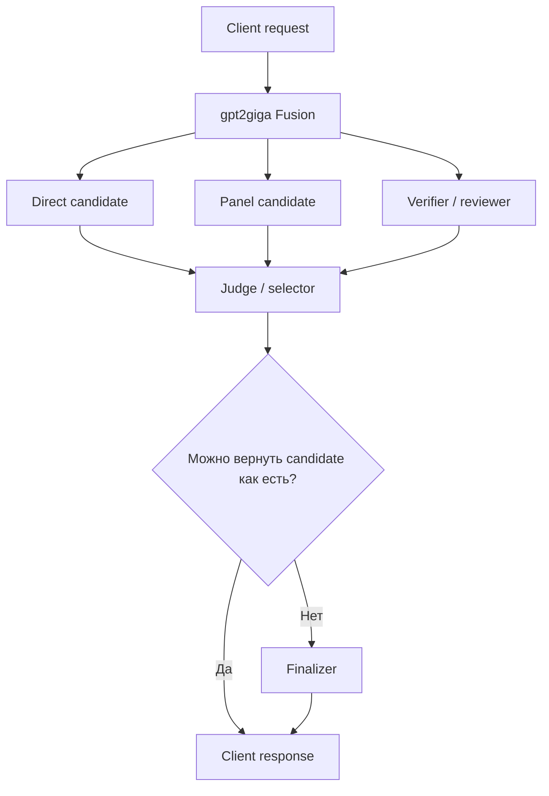
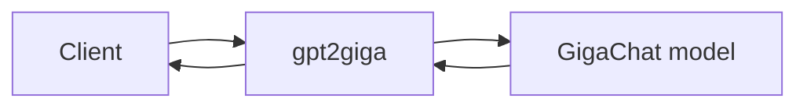
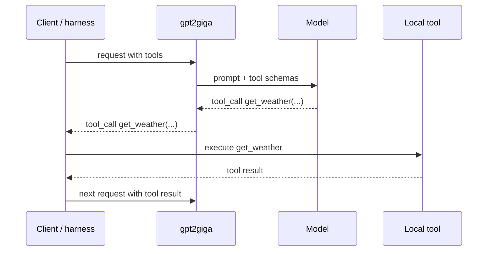
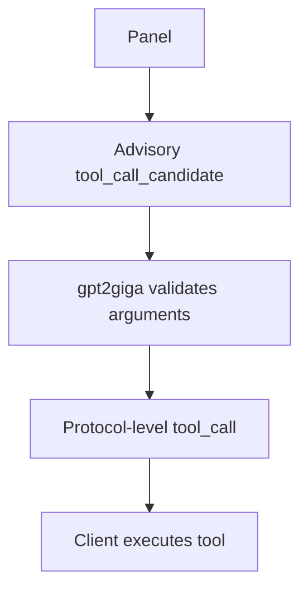
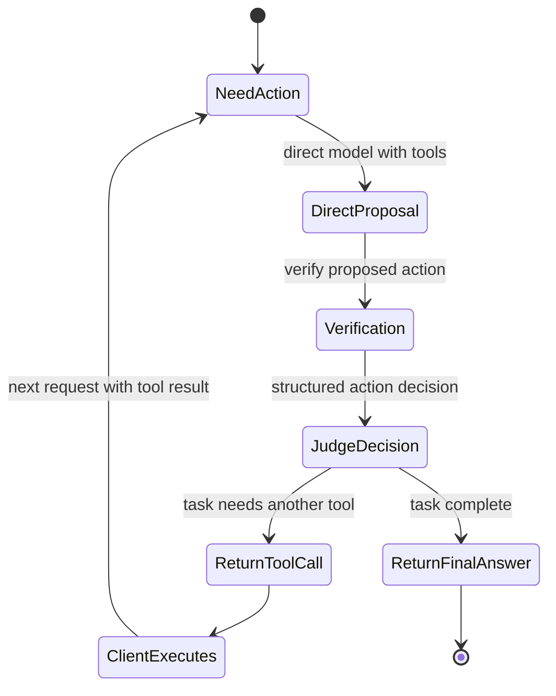
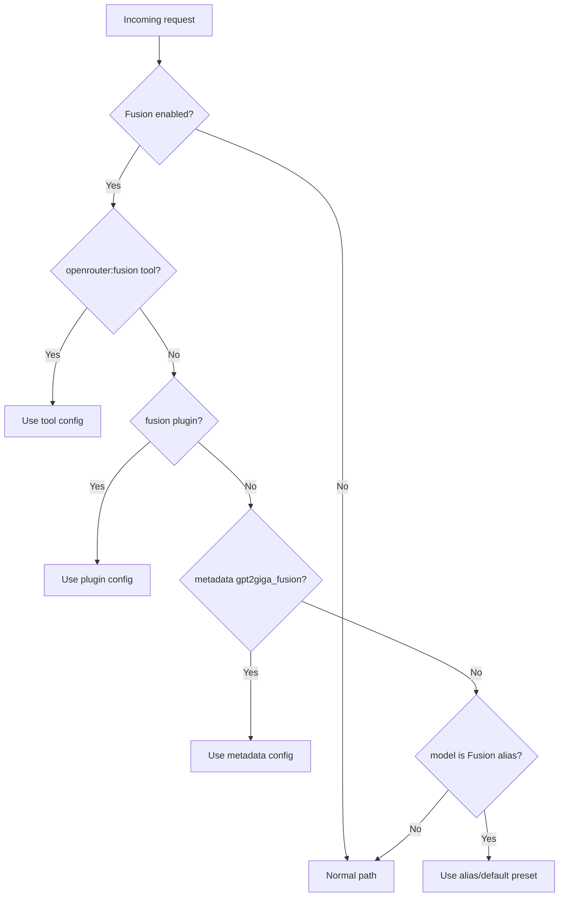

# GigaFusion: как выбрать режим

Эта страница объясняет, когда включать GigaFusion, почему один клиентский запрос
может превращаться в несколько внутренних вызовов модели и чем отличаются
benchmark-режимы от режимов для tool-агентов.

Полный справочник по aliases, переменным окружения и metadata находится в
[GigaFusion](fusion.md). Внутренние границы модулей описаны в
[Fusion provider architecture](architecture/fusion-provider.md).

## Главная идея

Fusion - не отдельная upstream-модель. Это режим оркестрации внутри `gpt2giga`:
proxy может получить прямой ответ GigaChat, запустить один или несколько panel
answers, попросить judge/selector выбрать лучший вариант и при необходимости
передать результат finalizer. Клиент при этом получает один обычный ответ в
OpenAI-, Anthropic- или Gemini-compatible формате.



Компромисс простой: Fusion покупает дополнительную проверку и сравнение ценой
дополнительных model calls, latency и токенов. Не включайте его для всего
трафика по умолчанию, пока не измерены p95 latency, fallback rate, rewrite rate,
judge parse errors и selected-candidate distribution.

## Быстрый выбор

| Сценарий | Что выбрать |
|---|---|
| Быстрый чат, autocomplete, короткие простые запросы | Обычная GigaChat-модель без Fusion |
| Text-only benchmark или ablation против direct Ultra | `gpt2giga/fusion-benchmark-text` |
| Benchmark, где request содержит client tools | `gpt2giga/fusion-benchmark` или `gpt2giga/fusion-benchmark-tools` |
| Codex/Claude Code/Qwen Code-style tool loop | `gpt2giga/fusion-code` |
| Более осторожный agent preset с selector/finalizer arbitration | `gpt2giga/fusion-code-agent-safe` |
| Свой эксперимент через env | Generic alias `gpt2giga/fusion` плюс `GPT2GIGA_FUSION_DEFAULT_PRESET` или request-level `preset` |

Specific aliases выбирают встроенные presets. Если нужно, чтобы
`GPT2GIGA_FUSION_DEFAULT_PRESET` был единственным источником правды, используйте
generic alias `gpt2giga/fusion` или явно передавайте `preset` в metadata.

## Обычный запрос и Fusion-запрос

В обычном режиме proxy отправляет один upstream request и возвращает ответ этой
модели.



В Fusion тот же клиентский запрос может стать такой цепочкой:

```text
1 direct call
+ N panel calls
+ 1 judge или selector call
+ optional finalizer call
```

Direct и panel calls могут идти параллельно, но они все равно расходуют upstream
concurrency и токены.

## Внутренние роли

| Роль | Что делает |
|---|---|
| Direct candidate | Baseline-like ответ на исходный запрос без Fusion panel envelope. |
| Panel candidate | Независимый ответ с дополнительной ролью, например `solver`, `reviewer` или `verifier`. |
| Verifier | Panel role или action-mode stage, который проверяет предложенный ответ или tool call. |
| Judge / selector | Сравнивает candidates и решает, что вернуть клиенту. |
| Finalizer | Переписывает или финализирует ответ, только если выбранный candidate нельзя вернуть как есть. |

## Benchmark Fusion

Benchmark Fusion нужен, чтобы измерить, помогает ли дополнительный panel и
selector получить лучший результат, чем прямой вызов модели. Этот режим полезен
для benchmark runs, ablations, разбора провалов и отладки selector.

Text-only benchmark обычно выглядит так:

```text
direct candidate + solver panel + selector
```

Используйте `gpt2giga/fusion-benchmark-text`, когда request не содержит client
tools. Этот alias ведет во встроенный preset `force-benchmark-selector` с
`tools_mode="off"`.

```dotenv
GPT2GIGA_FUSION_ENABLED=True
GPT2GIGA_FUSION_DEFAULT_PRESET=force-benchmark-selector
```

Пример request:

```json
{
  "model": "gpt2giga/fusion-benchmark-text",
  "messages": [
    {"role": "user", "content": "Solve the task and preserve the exact output format."}
  ]
}
```

Для benchmark-трафика с client tools используйте `gpt2giga/fusion-benchmark` или
`gpt2giga/fusion-benchmark-tools`. Оба alias ведут в
`force-benchmark-selector-tools`: panels видят tool schemas только как справку,
а direct tool calls проходят через selector arbitration.

## Почему tools требуют отдельного режима

Agent harness не дает модели выполнять tools напрямую. Модель возвращает
protocol-level `tool_call` или `function_call`, клиент выполняет функцию и
присылает результат следующим запросом.



Fusion panels не должны выполнять реальные tools. Если нескольким panels дать
право писать файлы, запускать shell или дергать внешние системы, side effects
случатся до того, как judge выберет лучший путь.

Поэтому panel tool calls являются advisory only. Panel может предложить tool
call, но наружу настоящий protocol-level tool call возвращает только
judge/finalizer path после validation.



## Verified tool loop

Verified tool loop нужен coding agents и другим multi-turn clients, где важно
не просто написать красивый ответ, а выбрать следующее действие. Модель не
должна финализировать задачу, если ей еще нужен file read, shell command, API
call или другой tool result.

`gpt2giga/fusion-code` ведет в preset `verified-tool-loop-ultra`:

```text
direct proposes action
verifier checks it
judge returns action decision
client executes tool
next request continues the loop
```



Встроенный preset использует:

```text
decision_mode="action"
candidate_stage_order="direct_then_verify"
direct_tool_call_policy="verify_before_return"
post_tool_mode="verified_continuation"
tools_mode="schema_only"
max_client_tool_rounds=8
```

Это означает, что direct tool calls проверяются перед возвратом клиенту, а после
tool result verified loop может продолжиться вместо принудительного финального
ответа.

## Не используйте finalize для multi-tool задач

`post_tool_mode="finalize"` отключает tools после tool result и просит модель
сразу написать финальный текст. Это подходит только тогда, когда одного tool
result достаточно.

Для задач вроде:

```text
check weather -> find hotel -> convert currency -> answer in Russian
```

нужно несколько tool rounds. Используйте `verified_continuation`,
`fusion_continuation` или хотя бы `direct_continuation`; не используйте
`finalize`.

## Как выбирается preset

Fusion запускается только когда `GPT2GIGA_FUSION_ENABLED=True` и request попал
под Fusion detection.



Priority:

```text
request-level preset > alias-specific preset > GPT2GIGA_FUSION_DEFAULT_PRESET
```

Главные aliases:

| Alias | Built-in preset |
|---|---|
| `gpt2giga/fusion` | Default preset, если request не переопределил его |
| `gpt2giga/fusion-benchmark-text` | `force-benchmark-selector` |
| `gpt2giga/fusion-benchmark` | `force-benchmark-selector-tools` |
| `gpt2giga/fusion-benchmark-tools` | `force-benchmark-selector-tools` |
| `gpt2giga/fusion-code` | `verified-tool-loop-ultra` |
| `gpt2giga/fusion-code-agent-safe` | `code-agent-safe` |

## Главные настройки простыми словами

| Setting | Что означает |
|---|---|
| `analysis_models` | Модели для panel calls. |
| `direct_model` | Модель для baseline-like direct candidate. |
| `judge_model` | Модель, которая сравнивает candidates или выбирает следующее действие. |
| `final_model` | Optional модель для rewrite/finalization, если это нужно. |
| `panel_roles` | Роли вроде `solver`, `reviewer`, `verifier`. |
| `include_direct_candidate` | Добавить direct answer как candidate. Обычно полезно для selector presets. |
| `return_selected_candidate` | Вернуть выбранный candidate без finalizer, если rewrite не нужен. |
| `invocation_mode="force"` | Всегда запускать Fusion для этого request. |
| `decision_mode="selector"` | Выбрать candidate через `FusionSelection`. |
| `decision_mode="action"` | Решить, вернуть tool call, final answer или blocked action. |
| `tools_mode="off"` | Panels не видят client tools. Хорошо для text-only benchmarks. |
| `tools_mode="schema_only"` | Panels видят schemas как справку, но не выполняют tools. |
| `direct_tool_call_policy="return_immediately"` | Вернуть валидный direct tool call без дополнительной Fusion-проверки. |
| `direct_tool_call_policy="selector"` | Провести direct tool call через selector comparison. |
| `direct_tool_call_policy="verify_before_return"` | Проверить direct tool call перед возвратом клиенту. |
| `post_tool_mode="direct_continuation"` | После tool result продолжить одним direct model call. |
| `post_tool_mode="fusion_continuation"` | После tool result снова запустить Fusion pipeline. |
| `post_tool_mode="verified_continuation"` | После tool result продолжить verified action loop. |
| `max_client_tool_rounds` | Safety limit для client-visible tool rounds. |

## Диагностика

Если Fusion не запускается, проверьте:

```text
GPT2GIGA_FUSION_ENABLED
requested model alias
request-level enabled=false
resolved preset
invocation_mode
```

Если tools не выполняются, убедитесь, что наружу вернулся protocol-level tool
call, а не обычный JSON-текст от panel. Также проверьте:

```text
tools_mode
direct_tool_call_policy
post_tool_mode
candidate summary with full tool arguments
```

Если модель финализирует слишком рано, проверьте:

```text
post_tool_mode is not finalize
max_client_tool_rounds is high enough
instructions state which tool results are required before final answer
```

Если selector выбрал panel хуже direct, смотрите response metadata и
observability signals:

```text
selected_candidate_id
selected_candidate_source
needs_rewrite
fallback_reason
judge_parse_error
panel_truncated
```

## Короткое резюме

Fusion лучше воспринимать как два связанных режима, а не как один универсальный
переключатель.

| Режим | Для чего нужен | Как выглядит |
|---|---|---|
| Benchmark Fusion | Quality experiments и сравнение direct-vs-panel | direct + panel + selector |
| Agent Fusion | Tool agents, которым нужны проверенные следующие действия | direct action + verifier + judge + tool loop |

Fusion полезен там, где сравнение и проверка стоят дополнительной latency. Для
простого или latency-sensitive трафика прямой вызов GigaChat остается правильным
default.
