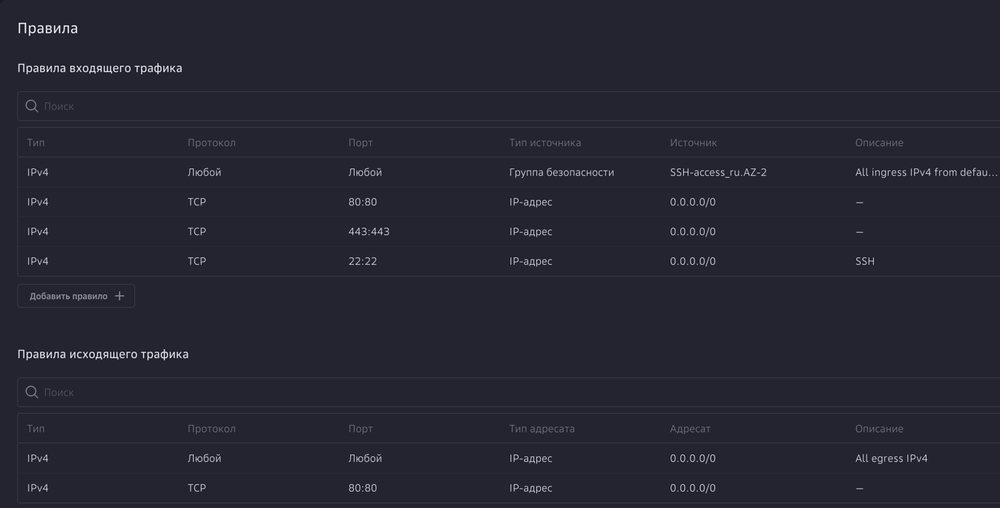

# Развёртывание gpt2giga за nginx (Ubuntu)

Краткая пошаговая инструкция: как поднять прокси **gpt2giga** на сервере Ubuntu с **nginx**, **Docker** и TLS-сертификатом **Let's Encrypt**. В итоге API будет доступен по HTTPS (по IP или домену).

**Что понадобится:** сервер Ubuntu с доступом по SSH, (опционально) домен или внешний IP для сертификата.

---

## Содержание

1. [Подготовка сервера](#1-подготовка-сервера)
2. [Файрвол (UFW)](#2-файрвол-ufw)
3. [Nginx](#3-nginx)
4. [Docker](#4-docker)
5. [Certbot (Let's Encrypt)](#5-certbot-сертификаты-lets-encrypt)
6. [Получение TLS-сертификата](#6-получение-tls-сертификата)
7. [Настройка nginx](#7-настройка-nginx)
8. [Запуск gpt2giga (Docker)](#8-запуск-gpt2giga-docker)
9. [Проверка](#9-проверка)

---

## 1. Подготовка сервера

Клонируйте репозиторий и установите базовые пакеты:

```bash
sudo -i # Для Cloud.ru
sudo apt update
sudo apt install -y git
git clone https://github.com/ai-forever/gpt2giga.git
cd gpt2giga
```

---

## 2. Файрвол (UFW)

Откройте порты для SSH, HTTP и HTTPS и включите файрвол:

```bash
sudo apt install -y ufw
sudo ufw allow OpenSSH
sudo ufw allow 80/tcp
sudo ufw allow 443/tcp
sudo ufw enable
sudo ufw status
```

### 2.1 Файрвол на Cloud.ru

Если сервер в Cloud.ru, порты настраиваются через **группы безопасности** в панели, а не только через UFW. Откройте входящий трафик на порты 22 (SSH), 80 (HTTP) и 443 (HTTPS), как на скриншоте:



---

## 3. Nginx

Установите nginx и включите его автозапуск:

```bash
sudo apt update
sudo apt install -y nginx
sudo systemctl enable --now nginx
```

---

## 4. Docker

Пакеты Docker в стандартных репозиториях Ubuntu часто отсутствуют. Добавьте официальный репозиторий Docker:

```bash
sudo apt-get update
sudo apt-get install -y ca-certificates curl gnupg software-properties-common

sudo install -m 0755 -d /etc/apt/keyrings
curl -fsSL https://download.docker.com/linux/ubuntu/gpg | sudo gpg --dearmor -o /etc/apt/keyrings/docker.gpg
sudo chmod a+r /etc/apt/keyrings/docker.gpg

echo \
  "deb [arch=$(dpkg --print-architecture) signed-by=/etc/apt/keyrings/docker.gpg] https://download.docker.com/linux/ubuntu \
  $(. /etc/os-release && echo "$VERSION_CODENAME") stable" | sudo tee /etc/apt/sources.list.d/docker.list > /dev/null

sudo apt-get update
sudo apt install -y docker-ce docker-ce-cli containerd.io docker-buildx-plugin docker-compose-plugin

docker --version  && docker compose version
```

---

## 5. Certbot (сертификаты Let's Encrypt)

```bash
sudo apt update
sudo apt install -y snapd
sudo snap install core
sudo snap refresh core
sudo snap install --classic certbot
sudo ln -sf /snap/bin/certbot /usr/bin/certbot
certbot --version
```

---

## 6. Получение TLS-сертификата

Сертификат можно получить на **внешний IP** сервера (доступ по HTTPS по IP, без домена).

Узнайте внешний IP и **временно остановите nginx** — certbot в режиме `--standalone` сам займёт порт 80:

```bash
PUBLIC_IP="$(curl -s https://api.ipify.org)"
echo "$PUBLIC_IP"
sudo systemctl stop nginx
```

Получите сертификат (подставьте свой email вместо `you@example.com`):

```bash
sudo certbot certonly --standalone \
  --ip-address "$PUBLIC_IP" \
  --preferred-profile shortlived \
  --cert-name gpt2giga-ip \
  -m you@example.com --agree-tos
```

Проверьте, что файлы появились:

```bash
sudo ls -la /etc/letsencrypt/live/gpt2giga-ip/
```

---

## 7. Настройка nginx

Команды выполняйте **из корня репозитория** gpt2giga.

Скопируйте конфиг в nginx и включите сайт:

```bash
sudo cp integrations/nginx/gpt2giga.conf /etc/nginx/sites-available/gpt2giga
sudo ln -sf /etc/nginx/sites-available/gpt2giga /etc/nginx/sites-enabled/gpt2giga
sudo rm -f /etc/nginx/sites-enabled/default
```

Если вы использовали другое имя сертификата (не `gpt2giga-ip`), отредактируйте пути к сертификатам в конфиге:

```bash
sudo vim /etc/nginx/sites-available/gpt2giga
```

Проверьте конфиг и перезапустите nginx:

```bash
sudo systemctl enable --now nginx
sudo nginx -t && sudo systemctl reload nginx
```

---

## 8. Запуск gpt2giga (Docker)

В корне репозитория создайте `.env` из примера и заполните переменные (учётные данные GigaChat, режим PROD, API-ключ прокси и т.д.):

```bash
cp .env.example .env
vim .env   # заполните GIGACHAT_*, GPT2GIGA_*
```

**Вариант с observability** (mitmweb для отладки трафика):

```bash
docker compose -f docker-compose-observability.yaml --profile PROD up -d
```

**Без observability** (только прокси):

```bash
docker compose --profile PROD up -d
```

---

## 9. Проверка

Подставьте в адреса ниже **свой внешний IP** (тот же, что использовали для сертификата):

| Сервис | URL |
|--------|-----|
| Прокси gpt2giga | `https://ВАШ_IP/` |
| Observability (если включён) | `https://ВАШ_IP/observability/` |

Проверка здоровья API с сервера или с вашей машины:

```bash
curl -k https://ВАШ_IP/health
```

Ожидаемый ответ: `{"status":"ok","mode":"PROD"}`.

---

## Полезные замечания

- **Nginx:** конфиг `gpt2giga.conf` проксирует на `127.0.0.1:8090` (gpt2giga) и `127.0.0.1:8081` (mitmweb). Пути к сертификатам заданы под имя `gpt2giga-ip`.
- **Переменные окружения:** шаблон — корневой `.env.example`.
- **Production:** задайте `GPT2GIGA_MODE=PROD`, при необходимости включите API-key и ограничьте CORS — подсказки есть в `.env.example`.
